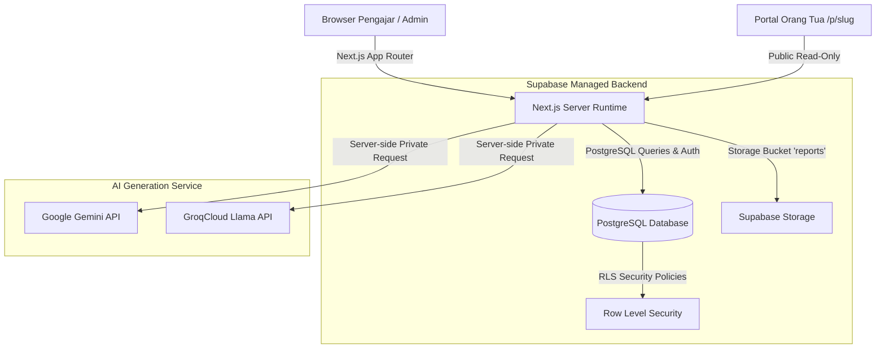

# Daely Report Studio

> Sistem otomasi laporan progres belajar murid cerdas bertenaga AI untuk lembaga kursus, bimbel, dan pengajar privat — dilengkapi dengan portal publik interaktif untuk orang tua murid.

[](LICENSE)
[](https://nextjs.org/)
[](https://supabase.com/)
[](https://www.typescriptlang.org/)

---

## 1. Arsitektur Sistem



---

## 2. Fitur Unggulan Komersial

- **Mesin Generate Laporan AI Few-Shot**: Menghasilkan draf laporan terstruktur (Overview, Catatan Guru, Rekomendasi Latihan, dan Catatan Orang Tua) dengan gaya bahasa alami yang meniru contoh dataset Anda.
- **Portal Publik Interaktif Wali Murid (`/p/[slug]`)**: Halaman transparan dan elegan bagi orang tua untuk memantau progres belajar, sorotan foto dokumentasi, riwayat pertemuan, dan mengirim masukan balik.
- **Dukungan Multibahasa Instan (i18n)**: Beralih mulus antara Bahasa Indonesia (ID) dan Bahasa Inggris (EN).
- **Arsitektur Keamanan Berlapis (Security-Hardened)**:
  - Row Level Security (RLS) PostgreSQL untuk isolasi multi-tenant data antar guru.
  - Kunci API AI diamankan secara eksklusif di server runtime (`SUPABASE_SERVICE_ROLE_KEY` / `AI_API_KEY`).
  - Proteksi Rate Limiting *sliding-window* in-memory (10 request/menit per pengguna) dan validasi batas panjang input observasi.
  - Query portal publik terindeks $O(1)$ untuk kecepatan akses dan pencegahan kebocoran data murid lain.
- **Manajemen Guru & Transfer Murid (Super Admin)**: Kemampuan administrator cabang memindahkan murid antar guru secara instan berikut seluruh riwayat laporannya.
- **White-Label Ready**: Mudah di-*rebrand* menjadi nama dan logo lembaga Anda sendiri dalam hitungan menit.

---

## 3. Panduan Instalasi Cepat (Quickstart)

### Prasyarat Sistem
- Node.js versi `20.x` atau lebih baru
- npm, pnpm, atau yarn
- Akun gratis di [Supabase](https://supabase.com/)
- Akun gratis di [Google AI Studio](https://aistudio.google.com/) (untuk API Key Gemini)

---

### Langkah 1: Kloning & Instalasi Dependensi
```bash
git clone https://github.com/revanzaRaihan/daereport.git
cd daereport
npm install
```

---

### Langkah 2: Setup Database Supabase (Sekali Eksekusi)
1. Buat project baru di [Supabase Dashboard](https://supabase.com/dashboard).
2. Buka menu **SQL Editor** pada project Supabase Anda.
3. Buka file [`supabase/schema.sql`](file:///c:/Users/user/.gemini/antigravity/scratch/dreport-studio-next/supabase/schema.sql) di repositori ini, salin seluruh kodenya, tempel (*paste*) ke SQL Editor, dan klik **Run**.
4. *(Opsional)* Untuk mengisi dataset contoh bawaan awal, buka file [`supabase/seed.sql`](file:///c:/Users/user/.gemini/antigravity/scratch/dreport-studio-next/supabase/seed.sql), tempel ke SQL Editor, dan klik **Run**.
5. Buka menu **Storage** -> **New Bucket**:
   - Beri nama bucket: `reports`
   - Aktifkan opsi **Public bucket** (agar foto dokumentasi dapat dimuat di portal orang tua).

---

### Langkah 3: Konfigurasi Environment Variable
Salin file template `.env.example` menjadi `.env.local`:
```bash
cp .env.example .env.local
```

Buka `.env.local` dan lengkapi nilainya:
```env
# Dapatkan di Supabase Dashboard -> Project Settings -> API
NEXT_PUBLIC_SUPABASE_URL=https://xxxxxxxxxxxxxxxxxxxx.supabase.co
NEXT_PUBLIC_SUPABASE_ANON_KEY=eyJhbGciOiJIUzI1NiIsInR5c...
SUPABASE_SERVICE_ROLE_KEY=eyJhbGciOiJIUzI1NiIsInR5c...

# Kredensial AI (Google AI Studio)
AI_PROVIDER=gemini
AI_MODEL=gemini-2.5-flash
AI_API_KEY=AIzaSy...

# Branding & Notifikasi
NEXT_PUBLIC_APP_NAME="Nama Lembaga Anda"
NEXT_PUBLIC_BRANCH_ADMIN_EMAIL=admin@lembagaanda.com
```

---

### Langkah 4: Menjalankan Aplikasi
Jalankan server pengembangan lokal:
```bash
npm run dev
```
Buka browser pada [http://localhost:3000](http://localhost:3000).

---

## 4. Cara Membuat Akun Administrator Pertama

Untuk mengaktifkan fitur khusus Super Admin (rekap performa seluruh guru, transfer murid, dan konfigurasi API key sistem):

1. Daftar akun baru secara normal melalui halaman `/login` (mode Sign Up) di aplikasi Anda.
2. Buka **Supabase Dashboard** -> **Authentication** -> **Users**.
3. Cari akun email yang baru Anda daftarkan, klik menu titik tiga (...) -> **Edit user metadata**.
4. Tambahkan properti role:
   ```json
   {
     "role": "admin"
   }
   ```
5. Simpan perubahan. Akun Anda kini resmi memiliki status **Super Admin** dengan hak akses penuh ke menu Admin di halaman Murid, Riwayat, dan Pengaturan.

---

## 5. Kustomisasi Brand (White-Labeling)

Untuk mengganti logo, judul aplikasi, dan konfigurasi merek lembaga Anda, silakan ikuti petunjuk lengkap di:
- [Panduan White-Labeling (`docs/WHITE_LABEL_GUIDE.md`)](file:///c:/Users/user/.gemini/antigravity/scratch/dreport-studio-next/docs/WHITE_LABEL_GUIDE.md)

---

## 6. Lisensi Perangkat Lunak

Aplikasi ini dilindungi oleh lisensi komersial kepemilikan tunggal. Pembeli berhak mengoperasikan, memodifikasi, dan men-*deploy* kode sumber untuk kepentingan internal institusi atau klien tunggal, namun dilarang keras menjual kembali atau menyebarluaskan kode sumber secara bebas.

Detail lengkap hak dan batasan tercantum pada file [LICENSE](file:///c:/Users/user/.gemini/antigravity/scratch/dreport-studio-next/LICENSE).
